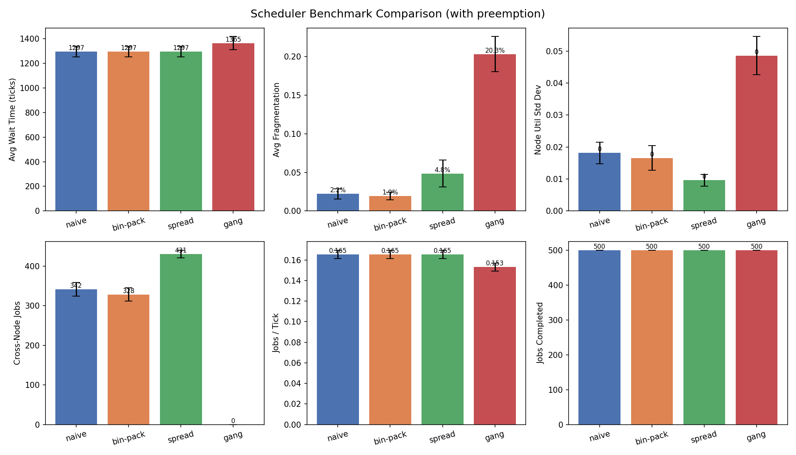

# GPU-Aware Cluster Scheduler Simulator

## What problem are we solving?

Modern AI and machine learning workloads need GPUs to run. If you have a cluster of machines (called **nodes**) with GPUs inside them, you need a **scheduler** to decide which job goes where. A bad scheduler wastes GPUs, makes jobs wait longer, or leaves some nodes overloaded while others sit idle. This project simulates different scheduling strategies so we can compare them head-to-head without needing real hardware.

## Why are we solving it?

Real GPU clusters are expensive and hard to experiment on. If you want to test a new scheduling idea, you'd have to build or rent a cluster, install software, and run jobs for days. Here, we simulate everything on your laptop in seconds. This lets us answer questions like:

- Does packing jobs onto the fewest nodes (bin-packing) work better than spreading them around?
- Is it worth forcing all GPUs for a job to be on the same machine?
- How much does preemption (kicking out low-priority jobs for high-priority ones) help?
- Which scheduling strategy keeps the cluster most balanced?

## What does each file do?

### `cluster.py` — The cluster model

Defines what a GPU cluster looks like:

- **GPU**: a single GPU with memory (e.g., 80 GB). Can be free or allocated to a job.
- **Node**: a machine with a list of GPUs. Tracks which GPUs are free, can allocate/free GPUs for jobs.
- **Cluster**: a collection of nodes. Tracks overall utilization, fragmentation (how scattered free GPUs are), and provides methods to allocate GPUs across multiple nodes.

### `job.py` — The job model and generator

- **Job**: a workload that needs a certain number of GPUs, memory, and time to run. Has a priority level and tracks when it was submitted, started, and completed.
- **JobGenerator**: creates random jobs with a fixed seed so experiments are reproducible. Each job gets random GPU/memory/duration/priority values.

### `simulation.py` — The simulation engine

Runs the clock tick by tick. On each tick:

1. **Complete** jobs whose duration has expired (frees their GPUs).
2. **Submit** new jobs that have arrived.
3. **Schedule** pending jobs using the chosen scheduler.
4. Track fragmentation, utilization balance, wait times, and other metrics.

Also supports **preemption**: high-priority (level 2) jobs can kick out lower-priority jobs to get GPUs faster.

### `schedulers/` — The scheduling algorithms

#### `base.py`
Abstract parent class. Every scheduler must implement `schedule(cluster, job)` which returns an allocation plan or `None` if the job can't fit.

#### `naive.py` — Naive Scheduler

Goes through nodes in order (node-0, node-1, node-2...) and grabs whatever free GPUs it finds first. If one node doesn't have enough, it spills to the next. Simple, but tends to fill up early nodes first.

#### `binpack.py` — BinPack Scheduler

Tries to pack jobs onto the fullest nodes first (least free GPUs). This means it fills up a few nodes completely before touching others. Good for freeing up entire nodes that can be powered down.

#### `spread.py` — Spread Scheduler

Does the opposite: puts jobs on the emptiest nodes first. When a job needs multiple GPUs, it puts one GPU per node in round-robin fashion. This keeps load balanced across all nodes.

#### `gang.py` — Gang Scheduler

Requires all GPUs for a job to be on the **same node** and **contiguous** (next to each other). This models a stricter placement constraint some production schedulers use, requiring co-located, contiguous GPUs to minimize inter-GPU communication overhead for distributed training jobs. It can reject jobs that would fit if spread across nodes.

### `simulate.py` — Command-line entry point

Lets you run a single simulation with any scheduler and see the results. All settings are controlled via flags:

```bash
python simulate.py --scheduler gang --jobs 500 --nodes 3 --gpus-per-node 4
```

### `benchmark.py` — Multi-run benchmark

Runs all four schedulers across many random seeds, collects statistics, prints a comparison table, and generates a bar chart (`benchmark_comparison.png`). Use this to get reliable, statistically sound results:

```bash
python benchmark.py --jobs 500 --seeds 20 --nodes 5 --gpus-per-node 8
```

### `test_scheduler.py` — Unit tests

24 automated tests that verify models, schedulers, and simulation all work correctly.

## Repository structure

```
.
├── cluster.py              # Cluster, Node, GPU models
├── job.py                  # Job model and JobGenerator
├── simulation.py           # Tick-based simulation engine
├── simulate.py             # CLI for single runs
├── benchmark.py            # Multi-seed benchmark + charts
├── test_scheduler.py       # 24 unit tests
├── schedulers/             # Scheduling algorithms
│   ├── __init__.py         # Exports all schedulers
│   ├── base.py             # Abstract base class
│   ├── naive.py            # First-fit in node order
│   ├── binpack.py          # Pack onto fullest nodes
│   ├── spread.py           # Spread across emptiest nodes
│   └── gang.py             # Same-node + contiguous only
├── benchmark_comparison.png # Generated chart (after benchmark run)
├── .gitignore
└── README.md
```

## Tech stack

| What | Why |
|------|-----|
| **Python 3.10+** | Standard for data/ML tooling |
| **No external deps** (for core) | Pure Python, zero install |
| **matplotlib** (optional) | For benchmark bar charts |
| **dataclasses** | Clean, boilerplate-free models |
| **abc** | Abstract scheduler interface |

The core simulation requires **no external packages**. Just Python 3.10+. For charts, install matplotlib:

```bash
pip install matplotlib
```

## Results

Benchmarked 1000 jobs across 10 random seeds on a 5-node, 8-GPU-per-node cluster (40 GPUs total). All numbers are mean ± 1 standard deviation. Results are consistent at both 500 and 1000 jobs; the 1000-job run is shown for tighter variance.



| Metric | Naive | BinPack | Spread | Gang |
|--------|-------|---------|--------|------|
| Avg wait time (ticks) | 2469.4 ± 70.2 | 2469.4 ± 70.2 | 2469.4 ± 70.2 | 2350.8 ± 95.1 |
| Avg fragmentation | 1.17% ± 0.42% | 0.93% ± 0.18% | 2.27% ± 0.54% | 37.31% ± 4.29% |
| Node util std dev | 0.013 ± 0.003 | 0.012 ± 0.002 | 0.009 ± 0.002 | 0.087 ± 0.007 |
| Cross-node jobs | 688 ± 42 | 636 ± 42 | 865 ± 17 | 0 ± 0 |
| Jobs / tick | 0.1657 ± 0.0049 | 0.1657 ± 0.0049 | 0.1657 ± 0.0049 | 0.1502 ± 0.0039 |
| Jobs completed | 1000 ± 0 | 1000 ± 0 | 1000 ± 0 | 1000 ± 0 |

**BinPack** produces the lowest fragmentation (0.93%) by packing jobs onto the fullest nodes first, and minimizes cross-node splitting (636 vs 688 for Naive). **Spread** creates the most cross-node jobs (865) by placing one GPU per node in round-robin, which raises fragmentation (2.27%) but gives the best load balance (node utilization std dev of 0.009 vs 0.013). **Gang** avoids cross-node placements entirely (0 cross-node jobs) but pays for it with high fragmentation (~37%) and slightly lower throughput (0.1502 vs 0.1657 jobs/tick). Wait times and completion counts are nearly identical across Naive, BinPack, and Spread since none of them refuse placements — when the cluster has enough capacity, any cross-node strategy works equally well for these metrics.

**Preemption** (500 jobs, 10 seeds, same cluster) was benchmarked separately. Its effects are most visible on Gang: fragmentation drops from 39.40% to 20.33% because high-priority jobs can carve out contiguous space by displacing lower-priority work. Naive, BinPack, and Spread see minimal change — their cross-node flexibility already handles contention without preemption. Wait times increase slightly across all schedulers (e.g., Naive from 1176.9 to 1297.2 ticks) since preempted jobs are re-queued and eventually complete, extending their total time in the system.

## Methodology and Limitations

- **Relative comparison, not production numbers.** These results compare algorithms against each other under identical simulated conditions. They are not benchmarks of real-world scheduler performance.
- **Cluster sizing matters.** With small clusters (e.g., 3 nodes x 4 GPUs) where job GPU requirements approach node capacity, scheduler choice has little effect on placement quality — large jobs are forced cross-node regardless of strategy. Meaningful comparison requires node capacity large enough that most jobs can fit on a single node.
- **What the simulation does not model:** real hardware failures, heterogeneous GPU types (e.g., A100 vs H100), network cost between nodes, multi-tenant fairness policies, real driver or scheduler overhead, or energy consumption.
- **Statistical validity.** All comparisons are aggregated across 10 random seeds with reported variance, not single runs. Results are reproducible using the fixed-seed `JobGenerator`.

## How to reproduce results

### One-shot simulation

```bash
# Default: naive scheduler, 500 jobs, 3 nodes x 4 GPUs
# Note: the small default cluster (3 nodes x 4 GPUs) is useful for quick
# sanity checks but is too tight relative to job sizes to show meaningful
# differences between scheduling strategies. Use --nodes 5 --gpus-per-node 8
# (the benchmark default) for representative comparisons.
python simulate.py

# Try different schedulers
python simulate.py --scheduler bin-pack
python simulate.py --scheduler spread
python simulate.py --scheduler gang

# Representative cluster size
python simulate.py --scheduler gang --nodes 5 --gpus-per-node 8 --jobs 1000

# Enable preemption
python simulate.py --scheduler naive --preempt
```

### Full benchmark

```bash
# Compare all schedulers across 20 random seeds (5 nodes x 8 GPUs, 500 jobs)
python benchmark.py

# More jobs + more seeds for tighter results
python benchmark.py --jobs 1000 --seeds 30

# Big cluster (40 GPUs total)
python benchmark.py --nodes 5 --gpus-per-node 8

# Benchmark with preemption enabled
python benchmark.py --preempt

# Benchmark specific schedulers only
python benchmark.py --schedulers naive gang

# Skip chart generation
python benchmark.py --no-charts
```

### Run tests

```bash
python test_scheduler.py
```

All 24 tests should pass with output like `24/24 passed`. Tests cover: cluster allocation and deallocation logic, fragmentation and utilization calculations, correctness of each scheduler's placement decisions on hand-constructed cases, and gang scheduling's contiguous-block requirement.
